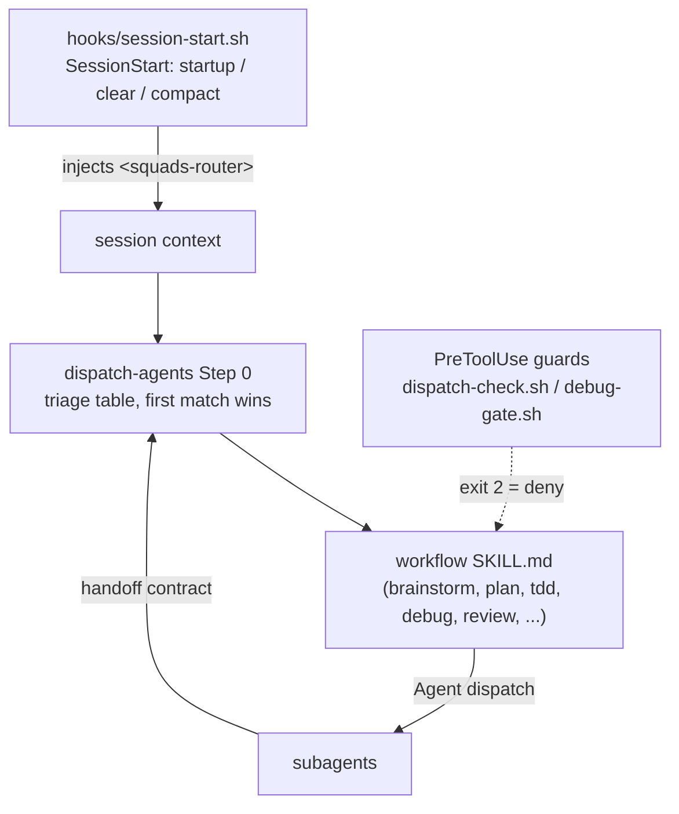

# Architecture

How the `squads` plugin works under the hood. Read this before adding a workflow skill — the checklist at the end assumes the sections before it.

No build step, no runtime. The plugin is four kinds of files:

| Path                                            | Role                                                           |
| ----------------------------------------------- | -------------------------------------------------------------- |
| `.claude-plugin/plugin.json`/`marketplace.json` | manifest (name, version, keywords)                             |
| `skills/<name>/SKILL.md`                        | one file per workflow: YAML frontmatter + markdown body        |
| `hooks/` + `hooks/hooks.json`                   | plain bash guards and their wiring                             |
| `skills/<name>/scripts/`                        | optional helpers (bash or Python) a skill's steps shell out to |

`package.json`'s only devDependency is `prettier` (formatting). Despite README wording, there is no Node hook — all hooks are `.sh`.

## System map



Skills link to each other via relative markdown links and "Next Skills" tables, forming a DAG lifecycle: brainstorm → plan (draft/validate) → dispatch/tdd → debug → review (request/resolve).

## Contracts

**SKILL.md shape** — each skill is one file:

```
---
name: dispatch-agents
description: Use when any new task or request arrives, before other skills...
argument-hint: '[fleet task, or path to approved plan]'
---
# body: Strict Rules / Steps / Next Skills table
```

`description` is the trigger Claude reads to decide _when_ to invoke the skill — not a comment. `user-invocable: false` + `disable-model-invocation: true` marks a skill as injected content only, never picked by model or user directly — the router paragraph inlined in `hooks/session-start.sh` is the equivalent: a literal string, no SKILL.md of its own.

**Handoff contract** — every subagent → main-thread return follows one canonical struct (defined in `dispatch-agents/SKILL.md#handoff-contract`):

```
status:    PASS | FAIL | PARTIAL
completed: [items with file:line or URL]
skipped:   [items with reason]
findings:  [{ claim, location: "file:line|URL", severity: HIGH|MED|LOW }]
commands:  [{ cmd, exit_code, stdout_tail }]
artifacts: [absolute paths written]
```

This is how state moves hub-and-spoke between dispatcher and subagents, which can't talk to each other directly.

## Enforcement: soft vs ha rd

| Layer             | Where                                                                                                                  | Guarantee                             |
| ----------------- | ---------------------------------------------------------------------------------------------------------------------- | ------------------------------------- |
| Soft — prompt     | `session-start.sh` router injection + `dispatch-agents` Step 0 triage table                                            | None — pure instruction               |
| Hard — PreToolUse | `dispatch-check.sh` (matcher `Task\|Agent\|SendMessage`), `debug-gate.sh` (matcher `Skill\|Write\|Edit\|NotebookEdit`) | Real — `jq` parse, deny with `exit 2` |

**Soft.** `hooks/session-start.sh` fires on every SessionStart (`startup|clear|compact`): inlines a one-paragraph router as a literal string, wraps it in `<squads-router>` sentinel tags, prints it into context. That's the entire router — one paragraph saying "route to dispatch-agents," re-injected every session/compact so it survives context compaction. `dispatch-agents` Step 0 is a markdown table: request pattern → workflow skill → fleet shape. First match wins; no code enforces it.

**Hard.** Per `hooks/hooks.json`, the two guards parse the tool-call JSON with `jq` and `exit 2` (deny) on:

- unresolved `{{placeholder}}` reaching a subagent
- a raw diff dispatched without an `<untrusted_context>` wrapper
- a 3rd reviewer dispatch for the same change (2-pass re-review cap)
- a code edit attempted while `parallel-debugging`'s hard gate is open

Gate state is a flag file in `$TMPDIR` keyed by `session_id`, with a 120-minute expiry and cleanup on SessionEnd (`hooks/session-end.sh`).

**Takeaway:** skill markdown is advisory routing; hooks are the only real guarantee. Anything that must never be skipped belongs in a hook, not prose.

## Script patterns

| Pattern                            | Example                                                 | Notes                                                                                                                                                                                                                                                                                                                  |
| ---------------------------------- | ------------------------------------------------------- | ---------------------------------------------------------------------------------------------------------------------------------------------------------------------------------------------------------------------------------------------------------------------------------------------------------------------- |
| Deterministic replace-N-tool-calls | `skills/parallel-brainstorming/scripts/scan_context.py` | Parallel `git grep`/`rg` via `ThreadPoolExecutor`; caps and truncates every output field (each cap has an inline reasoning comment, e.g. `_MAX_FILES = 5`); one JSON blob on stdout. Replaces a dozen sequential Glob/Grep calls — token savings. Sanitizes argv before it reaches grep as a regex (`_sanitize_noun`). |
| Sourced bash snippet               | `skills/review/scripts/resolve-base.sh`    | Tiny, `source`-able, sets one global (`DEF`); documents an inline-copy fallback in its own header comment for callers that can't source it.                                                                                                                                                                            |

**Python 3.14 hard requirement:** `scan_context.py` uses `except OSError, json.JSONDecodeError:` syntax (3 places) — looks like Python 2, but is valid under Python 3.14's relaxed grammar (parses as `except (OSError, JSONDecodeError):`). `pyproject.toml` pins `target-version = "py314"`, so this is intentional, not a bug — but it hard-requires 3.14 and will `SyntaxError` on older interpreters (verified: fails on 3.13, passes on 3.14). Worth a `ponytail:` comment at the site if that constraint isn't obvious to future readers.

## Add a workflow skill

1. Create `skills/<your-workflow>/SKILL.md` — frontmatter + Strict Rules/Steps/Next Skills sections, matching the shape of existing skills.
2. Add a row to `dispatch-agents/SKILL.md` Step 0 triage table so requests route to it (first-match-wins — placement relative to neighboring rows matters).
3. Add it to any adjacent skill's "Next Skills" table and to `README.md`'s lifecycle diagram — cosmetic, but keeps the DAG legible.
4. Need a script? Add `skills/<name>/scripts/foo.{sh,py}`, referenced via `${CLAUDE_PLUGIN_ROOT}/skills/<name>/scripts/foo.sh` from the SKILL.md steps.
5. Need a real guarantee instead of a suggestion? Add a `PreToolUse` entry in `hooks/hooks.json` plus a bash guard following the `dispatch-check.sh` / `debug-gate.sh` pattern (`jq` parse → deny with `exit 2` and a message).
6. Bump `plugin.json` + `marketplace.json` version. `.claude/skills/release-plugin` (project-local — not a plugin skill) handles version bump, tag, and release.

No registration step beyond that — no build, no index file. A new `SKILL.md` is live next session because `dispatch-agents` reads its own triage table fresh on every invocation.

**Design question per new workflow:** does it need hook-level enforcement, or is a triage table row enough? Squads' own skills reserve hooks for the few things that would be genuinely bad if skipped (untrusted content, re-review loops, debug-before-fix); everything else relies on the prompt being followed.
