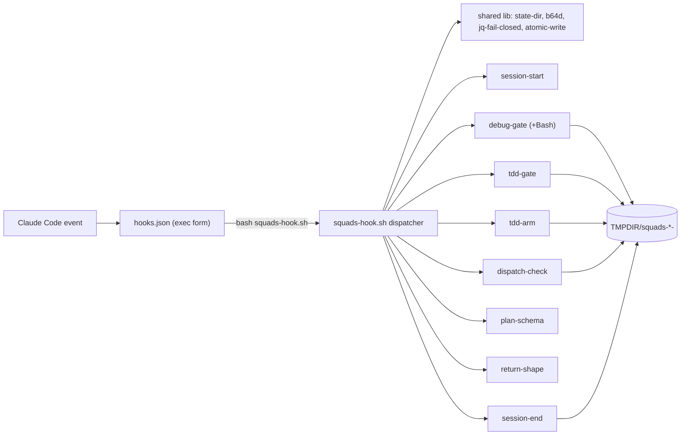

# squads hooks redesign — Design Brief

> Source: `/squads:parallel-brainstorming` over `hooks/` + `.claude/refs/*`, with a 6-agent adversarial audit workflow. Approach C locked by user; Phase 5 persona critique APPROVED.

### Approach

Consolidate the four bash hook scripts into one `hooks/squads-hook.sh` dispatcher — one rule function per hook, invoked as `squads-hook.sh <rule>` via **exec-form** `hooks.json` — fix every HIGH/MED defect the audit found, and add three new ethos-enforcing rules (tdd RED-gate, SubagentStop return-shape, plan-schema gate); every rule is wired into `hooks.json`.

### Why

- **Share helpers once, not four times.** `state-dir`, `b64d` (base64 `-d`/`-D`), `jq-fail-closed`, and `atomic-write` live in one sourced lib instead of being duplicated (and subtly diverging) across four files.
- **Exec form removes shell-tokenization risk** on `${CLAUDE_PLUGIN_ROOT}` path placeholders (ref docs' preferred form), and makes the `<rule>` subcommand self-documenting in the `/hooks` menu.
- **Closes the real HIGH defects:** the Bash bypass of the parallel-debugging HARD GATE, the fail-open 10 s timeout, and the stale "one Node hook" / "no runtime dependency" docs.
- **Adds the ethos hooks the plugin currently lacks**, each with a deterministic signal, mirroring the proven `debug-gate` pattern — the plugin "stands for" dispatch hygiene, reproduce-before-fix, RED-before-GREEN, structured returns, and plan discipline; hooks are the fail-closed backstop the skills can't guarantee alone.
- **Per-invocation isolation keeps blast radius small:** each `hooks.json` entry is a separate process with its own `<rule>` subcommand, so a logic bug in one rule cannot cascade to the others — only a file-level parse error is total, and that is guarded by a `bash -n` CI check.

### Scope

**L** for the actual change surface (`hooks/squads-hook.sh` + `hooks.json` + `AGENTS.md` + `README.md` + `.gitattributes` + one `package.json` script). scan_context reported **XL** cross-cutting (21 files matched across skills) because the ethos rules live in skill prose; the diff itself is bounded. Phase 5 ran on the XL flag.

### Constraints

- **Every new rule script is wired into `hooks.json`** — no orphan hook files (user guardrail).
- **Fail-closed must survive:** raise PreToolUse timeout `10`→`30` s; keep scripts lean (do not regress the single-jq-read-for-N-fields pattern; do not add process spawns); document the **residual platform limit** — a command-hook timeout is a non-blocking error (fail-OPEN) and is unfixable, only mitigated.
- **Windows 11 Git Bash target; `jq` required** (fail-closed without it, with an actionable install hint). `b64d` helper tries `base64 -d` then `base64 -D` (BSD/macOS).
- **No Node runtime** (correcting the stale "one Node hook" claim). Plugin ships markdown + bash only; no build step.
- **State files namespaced** `squads-<rule>-<sid>[-<key>]` under `${TMPDIR:-/tmp}`; `session-end` cleans `squads-*-<sid>*`; 120 min `find -mmin +120` expiry backstop per file (portable across GNU/BSD/Git Bash).
- **Every deny is actionable:** names the rule + a one-line remediation.
- **`set -uo pipefail` without `-e`** is intentional (grep -c / find / jq parse paths return non-zero legitimately) — preserved, with a one-line comment so it is not "fixed" later.

### Interface

`hooks.json` (exec form, `command: "bash"`, `args: ["${CLAUDE_PLUGIN_ROOT}/hooks/squads-hook.sh", "<rule>"]`):

| Event        | Matcher                                             | `<rule>`         | Notes                                                                                                                                      |
| ------------ | --------------------------------------------------- | ---------------- | ------------------------------------------------------------------------------------------------------------------------------------------ |
| SessionStart | `startup\|resume\|clear\|compact`                   | `session-start`  | router injection + honest wiring banner (all 4+ events)                                                                                    |
| PreToolUse   | `Agent\|SendMessage\|Workflow`                      | `dispatch-check` | **drop stale bare `Task`** (current tools = TaskCreate/Update/List/Get/Stop)                                                               |
| PreToolUse   | `Skill\|Write\|Edit\|MultiEdit\|NotebookEdit\|Bash` | `debug-gate`     | **+Bash**: inspect `tool_input.command` for write-to-file subcommands while flag set                                                       |
| PreToolUse   | `Write\|Edit\|MultiEdit\|NotebookEdit`              | `tdd-gate`       | NEW — deny non-test/non-md impl edit unless `squads-tdd-red-<sid>` flag set                                                                |
| PostToolUse  | `Bash`                                              | `tdd-arm`        | NEW — `exit_code != 0` (or test-fail keyword) → touch `squads-tdd-red-<sid>` (120 min)                                                     |
| PreToolUse   | `Write`                                             | `plan-schema`    | NEW — only for `docs/plan/*.plan.md` paths                                                                                                 |
| SubagentStop | (none)                                              | `return-shape`   | NEW — regex `last_assistant_message` for `^status:\s*(PASS\|FAIL\|PARTIAL)` + `findings:`; reviewer-dispatch sentinel → also the 5 headers |
| SessionEnd   | (none)                                              | `session-end`    | clean `squads-*-<sid>*`                                                                                                                    |

New rule function signatures (in `squads-hook.sh`):

- `tdd-gate` — PreToolUse Write/Edit/MultiEdit/NotebookEdit: if `file_path` is non-test, non-md production code AND no `squads-tdd-red-<sid>` flag → exit 2 "squads tdd-gate: no impl edit before a failing test is observed (RED before GREEN) — run the covering test and let it fail first, or invoke squads:tdd". Exempt glob mirrors `debug-gate`'s test/spec/md list **plus bare `test.*`/`spec.*`/`tests.*`** (fixes the audit's MED finding).
- `tdd-arm` — PostToolUse Bash: read `tool_response` exit code; non-zero → `touch "$TMPDIR/squads-tdd-red-<sid>"` (120 min expiry). Over-arm is safe (flag only permits, never blocks).
- `return-shape` — SubagentStop: 1st malformed `last_assistant_message` → exit 2 + stderr reminder (force one retry); 2nd → exit 0 + stdout diagnostic "squads return-shape: subagent did not return Handoff-Contract shape after retry — abort, route to parallel-debugging". Reviewer-dispatch sentinel (from the parent dispatch, carried in `agent_type`/context) → require the 5 review headers.
- `plan-schema` — PreToolUse Write to `docs/plan/*.plan.md`: read `tool_input.content`; if `Status: APPROVED` + `Depth: sketch` → deny; parse `### TASK-NNN:` blocks, require all 7 field labels (`Depends on / Files / Symbols / Satisfies / Action / Validate / Expected result`) → deny naming the missing field; require `Origin:` header. **Edit gap documented** (PreToolUse Edit can't see full result; optional PostToolUse re-read diagnostic deferred).

Existing-rule defect fixes folded into the port (per audit):

- `dispatch-check`: read `.session_id` raw (no `// "no-session-id"` default) so the empty-sid skip actually fires; add `.tool_input.description` to the inspected bodies; scan Workflow bodies for the reviewer sentinel too; widen raw-diff to `^--- ` / `^+++ ` / `diff -`; `flock … || deny` (not silent `exit 2`); validate count-file integer; atomic mktemp+mv write; hash fallback fail-closed when no hash tool; hash full Change-summary block (multiline).
- `debug-gate`: fail-close on empty `tool_name`; add bare `test.*`/`spec.*`/`tests.*` to the exemption glob; header comment lists `tdd / plan / review` as gate-lifts.
- `session-start`: wiring banner enumerates **all** hook events (SessionStart/PreToolUse/SessionEnd), not just PreToolUse; `jq … 2>/dev/null || true` so a missing/corrupt `hooks.json` degrades silently; `dirname`-based path so basename invocation works.
- `session-end`: correct the misleading empty-id comment (the bail is the safety, not the glob).

### Architecture

- One file, one rule function per `<rule>` subcommand; `case "$1" in <rule>) <fn> ;; esac` dispatch.
- Shared lib sourced at top (helpers), no global mutable state between rules.
- Each `hooks.json` entry = a separate OS process → logic-bug isolation per rule.
- Portability: `.gitattributes` (`*.sh text eol=lf`, `*.json text eol=lf`) + `git add --renormalize`; `b64d` helper; `flock` best-effort (absent on Git Bash + macOS) comment corrected.

### Risks

- **R1 (HIGH) — consolidated file parse error = total hook outage.** Mitigation: per-invocation isolation limits logic bugs to one rule; `bash -n hooks/*.sh` added to `npm run format:check` as a parse guard.
- **R2 (MED) — command-hook timeout is platform fail-OPEN, unfixable.** Mitigation: 30 s timeout + lean scripts (no spawn regression); residual documented in the header.
- **R3 (MED) — tdd-gate over-arms on any non-zero Bash (false RED).** Safe: the flag only _permits_ impl edits, never blocks; documented.
- **R4 (MED) — debug-gate Bash write-pattern heuristic → false-positive denies during a debug session.** Mitigation: conservative pattern list (`sed -i`, `tee`, `printf … >`, `cat … >`, `>`/`>>` redirects to a non-test/non-md path); route-to-sibling (tdd/plan/review) lifts the flag; 120 min expiry; pattern list is the tunable knob (`# ponytail: heuristic — pattern list is the calibration knob`).
- **R5 (MED) — SubagentStop return-shape can loop a non-compliant subagent.** Mitigation: deny 1st malformed (one retry), allow 2nd + abort diagnostic.
- **R6 (LOW) — plan-schema Edit gap (can't validate a patch's full result).** Mitigation: PreToolUse Write-only block; Edit gap documented; PostToolUse re-read diagnostic deferred (YAGNI until requested).
- **R7 (LOW) — CRLF renormalize touches repo files.** Mitigation: `.gitattributes` scoped to `*.sh` + `*.json` only.

### First Step

Create `hooks/squads-hook.sh` with the shared lib + the four existing rules ported verbatim-as-functions (defect fixes applied), then `bash -n hooks/squads-hook.sh`. Rewrite `hooks.json` to exec form calling `squads-hook.sh <rule>` (drop stale `Task`). Smoke each rule with `echo '{"tool_name":"…","tool_input":{…},"session_id":"t"}' | bash hooks/squads-hook.sh <rule>` before adding any new ethos rule — verify the existing gates still fire via `/hooks` first.
