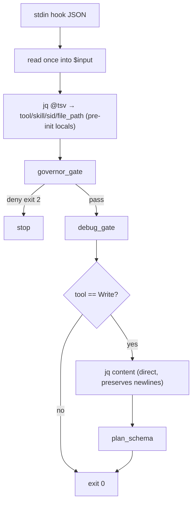

# hooks-improve — Design Brief

### Approach
Audit-gated win32 hardening (Approach C′): guard per-fire jq to one extraction + a dedicated content query, factor the duplicated plan-path glob into a bash helper, and only touch `state_dir()` if a concrete probe proves `/tmp` unreliable on this win32 box.

### Why
- Biggest per-fire cost is jq spawned ~5× per pre-tool (governor 2, debug 2, plan 1); one scalar extraction + one content query cuts that to 1–2 — a real `perf-hook.py report` p50/p95 win for a ~20-line diff.
- Keeps the dual-language safety net (Python wrapper + Bash dispatcher + no-python fallback) that Approach B would discard — R2 fail-open mitigation intact.
- jq stays the sole strip implementation, so deny strings and the Governor probe stay byte-identical (strict compat) — the Python-fallback variant (original change #4) was dropped after Skeptic + Constraint Guardian flagged byte-divergence.
- `state_dir()` only changes if the audit proves a real problem, honoring the audit-as-gate recommendation from the User Advocate re-validation.

### Scope
L

### Constraints
- **Strict compat:** rules (`session-start`, `dispatch-check`, `pre-tool`, `post-tool`), `exit 2` denies, `squads <gate>:` stderr prefixes (governor-gate, debug-gate, dispatch-check, plan-schema), JSONL record shape `{ts,rule,ms,exit?,tool?,skill?,session?,err?,timeout?}`, and the Governor's hook-fire probe (expects exactly the dispatch-check deny) — all unchanged.
- **Fail-open:** wrapper crash → exit 0; command-hook timeout → fail-open (R2 residual, documented). perf-hook.py must never alter the child's exit code or streams.
- `set -uo pipefail` **without** `-e` (grep/find legitimately non-zero).
- jq stays a hard dep: absent jq → dispatch-check fail-closed (unchanged); others fail-open.
- No new `${...}` references in `hooks.json` command strings (single-quoted `bash -c`; Claude Code expands `${CLAUDE_PLUGIN_ROOT}` before bash sees it).

### Interface
No external interface change. Internal `squads-hook.sh` shape:

```
is_plan_path() {  # <path> → 0 if plan file (factored case glob, same semantics)
  case "${1//\\//}" in
    */docs/plan/*.plan.md | docs/plan/*.plan.md) return 0 ;;
  esac
  return 1
}

pre_tool() {
  command -v jq >/dev/null 2>&1 || exit 0
  local input tool="" skill="" sid="" file_path="" content=""
  input=$(cat)
  IFS=$'\t' read -r tool skill sid file_path < <(jq -r '
    [.tool_name // "", .tool_input.skill // "",
     .session_id // "", (.tool_input.file_path // .tool_input.notebook_path // "")] | @tsv
  ' <<<"$input" 2>/dev/null) || true
  governor_gate "$tool" "$skill" "$sid"      # consume args, no re-parse
  debug_gate  "$tool" "$sid" "$file_path"
  [[ "$tool" == "Write" ]] && {
    content=$(jq -r '.tool_input.content // ""' <<<"$input" 2>/dev/null)
    plan_schema "$file_path" "$content"
  }
  exit 0
}
```

Gate signatures change from `<hook-input-json>` to pre-parsed scalars; `deny` bodies and all message strings verbatim. `post_tool` calls `is_plan_path` instead of its inline glob. `perf-hook.py` unchanged.

### Architecture
- `session-start` (SessionStart): unchanged.
- `PreToolUse Agent|SendMessage|Workflow` → `dispatch-check`: unchanged (jq-absent stays fail-closed).
- `PreToolUse Skill|Write|Edit|MultiEdit|NotebookEdit` → `pre-tool`:
  1. read stdin once into `$input`
  2. one jq → 4 scalars via `@tsv` → `IFS=$'\t' read -r` into pre-initialized locals (jq failure → empties → fail-open, not `set -u` abort)
  3. `governor_gate` (runs first; `deny`→`exit 2` structurally prevents `debug_gate` arming on a denied `squads:debug`)
  4. `debug_gate`
  5. on `Write`: second jq on `$input` for `content` (direct, not `@tsv` — preserves newlines for `plan_schema_violations` line greps) → `plan_schema`
- `PostToolUse Write|Edit|MultiEdit|NotebookEdit` → `post-tool`: uses `is_plan_path`; otherwise unchanged.
- `state_dir()` change is conditional on the audit (see First Step).



### Risks
- **HIGH — `@tsv` + `IFS=$'\t' read` mishandles a literal tab in `file_path`.** Severity HIGH, narrow trigger. Mitigation: tab-in-path is pathological and outside the existing contract (current `jq -r '.file_path'` per-gate calls also break on tab); document the ceiling with a `ponytail:` comment, no extra code.
- **MED — audit rubber-stamped → `state_dir` left unreliable.** Mitigation: audit is a concrete probe-write (see First Step); if inconclusive, **keep #1 with probe-write fallback**, never default to dropping.
- **MED — gate signature change touches all 3 gate fns.** Mitigation: `--self-check` extended to cover pre-tool paths (governor deny, debug arming, plan deny); manual dirty/clean dispatch-check + a Write to a malformed `docs/plan/*.plan.md`.
- **LOW — future reorder of governor/debug.** Mitigation: `deny`→`exit 2` already makes it structural; add a one-line comment at the call site.

### First Step
Run the audit: from Git Bash on this win32 box, `touch "${TMPDIR:-/tmp}/squads-probe-$$" && ls -la "${TMPDIR:-/tmp}/squads-probe-$$" && rm "${TMPDIR:-/tmp}/squads-probe-$$"` — record the resolved path in the plan. If `/tmp` is writable and resolves to a real Windows temp, **drop the `state_dir()` change** and proceed with only #2 (single-jq) + #6 (`is_plan_path`). If the probe fails or lands somewhere unreadable, implement `state_dir()` to probe-write the first writable of `TMPDIR`, `TEMP`, `TMP`, `/tmp`, silent fail-open if none. Then implement the `pre_tool` single-jq extraction + `is_plan_path`, and extend `perf-hook.py --self-check` to assert dirty→deny / clean→silent across the new path before any other change.