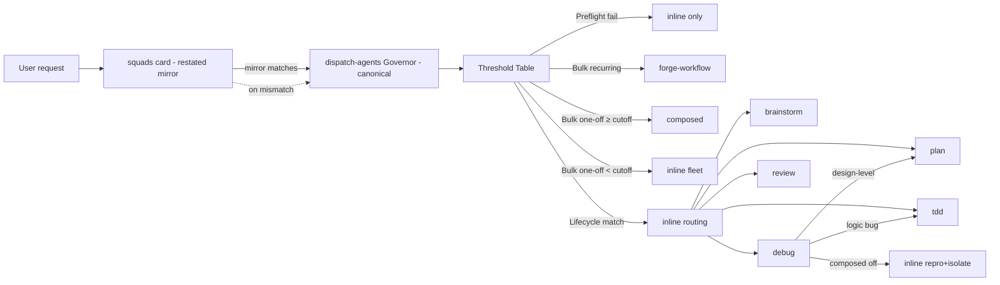

# Routing Correctness — Design Brief

### Approach

Make `dispatch-agents` the canonical routing source and the `squads` card a restated mirror with pinned precedence, and fix seven concrete routing discriminators in place across the skills — no new skill, no code, no runtime.

### Why

- The plugin already owns contracts in one place and links by anchor (Handoff, Invariants, Pattern Canon); routing tables duplicate across `squads` and `dispatch-agents` instead, so they drift. Pinning a canonical source + precedence line gives a deterministic winner on mismatch without abandoning the 40-line quick-map card.
- Keeping the `squads` Route table a restated mirror (not cite-only) preserves its core job: a model routes from the card alone without reading 185 lines. Cite-only was rejected by persona critique — it regressed card-only routing and banked on an unenforceable "Governor mandatory" assumption (the hook can't catch a no-Skill-call turn).
- Seven named routing defects have evidence today (dead forge row, "review PR #123" misroute, debug stranded when composed off, tdd/debug GREEN-without-RED overlap, subjective brainstorm/plan boundary, silent bulk-threshold, table drift). Each gets a concrete, deterministic fix.
- Extending the existing `<!-- do not rename -->` guard convention to routing anchors reuses a proven mechanism for anchor stability — the maximum achievable under the markdown-only constraint.

### Scope

L

### Constraints

- Markdown-only plugin: no runtime routing enforcement. jq/bash hook only; cannot catch a turn that never calls the Skill tool.
- No build step. No new scripts. No runtime checks.
- Cross-skill anchors must stay stable for links to resolve; stability is signposted via `<!-- do not rename -->` guard comments (convention, not enforcement).
- Precedence ("dispatch-agents wins") is documentation, not enforced — accepted constraint. Custom/sibling-skill precedence conflicts have no in-plugin resolver beyond model judgment (recorded LOW, mitigated by precedence line).

### Interface

Routing tables and discriminators affected (all markdown prose/table edits):

| Element | File | Change |
| :-- | :-- | :-- |
| Precedence line | `skills/dispatch-agents/SKILL.md`, `skills/squads/SKILL.md` | Add "dispatch-agents routing tables are canonical; squads card mirrors — on mismatch, dispatch-agents wins" in both. |
| Anchor guards | `skills/dispatch-agents/SKILL.md` | Add `<!-- do not rename: skills link #governor-threshold-table -->` and `... #inline-branch-routing-table -->` above those headings. |
| Threshold Table — bulk row | `skills/dispatch-agents/SKILL.md` | Redefine: recurring bulk (any size) → composed/forge; one-off bulk ≥ cutoff → composed; one-off bulk < cutoff → inline fleet. State cutoff by name ("currently 5"). |
| Inline routing — forge row | `skills/dispatch-agents/SKILL.md` | Redefine (not delete): "Recurring bulk → forge-workflow (saved `/command` workflow); one-off bulk < cutoff → inline fleet here." Removes contradiction with threshold note. |
| brainstorm/plan boundary | `skills/dispatch-agents/SKILL.md` inline table + both skills' `description:` | Replace "≥2 architectural approaches" with: plan when the request names a deliverable artifact (plan/spec/doc for a named feature); brainstorm when the request names a problem to explore with no deliverable shape. |
| review mode-inference | `skills/review/SKILL.md` Step 0 | Replace single-token vs multi-token rule with: feedback prose / `--resolve` → resolve; ref/path token (`git rev-parse`-verifiable, branch, commit, PR#, file path) → request; both signals → request; neither → `AskUserQuestion`. |
| debug composed-off | `skills/debug/SKILL.md` Step 2 | Add explicit degraded branch: when native workflows unavailable, fall back to single-thread inline reproduce + isolate (Step 1 repro, one-hypothesis inline investigation); state degraded mode; route the fix unchanged. Orthogonal to test-state (fix 5). |
| GREEN-without-RED owner | `skills/tdd/SKILL.md`, `skills/debug/SKILL.md` | Owner = tdd (test-discipline failure, not code bug). tdd keeps "GREEN with no observed RED → re-enter at RED." Narrow debug's "test fails unexpectedly" to "test RED unexpectedly" (actual failure). Audit cross-refs in both files so no orphaned trigger. |
| Squads Route mirror | `skills/squads/SKILL.md` | Keep restated rows; mirror the redefined bulk/forge and brainstorm/plan rows so the card matches the canonical table. Keep pipeline-order line + Contracts table. |
| Bulk-count surfacing | `skills/dispatch-agents/SKILL.md`, `skills/squads/SKILL.md` | State "one-off bulk below the cutoff (currently 5) routes inline — say so" so the < cutoff inline path is surfaced, not silent. Reference cutoff by name. |

### Architecture

- `squads/SKILL.md` (router card, 40L) — restated mirror + precedence line + pipeline order + Contracts table. Read alone → routes correctly.
- `dispatch-agents/SKILL.md` (Governor, 185L) — canonical Threshold Table + inline routing table, both under `<!-- do not rename -->` anchor guards. Single source of truth.
- Lifecycle skills (`brainstorm`, `plan`, `tdd`, `debug`, `review`) — `description:` frontmatter and Step 0 discriminators align with the canonical table; each owns its entry/exit text.
- `forge-workflow/SKILL.md` — reached for recurring bulk (any size) and composed runs; the inline one-off-bulk path no longer points here.

### Risks

- **HIGH — Mirror drift returns.** The restated `squads` Route table can still drift from the canonical `dispatch-agents` table. Mitigation: precedence line names the winner; anchor guards signpost the link; mirror is 7 rows in a 40-line card — small enough to sync at every routing change. Residual: discipline-dependent (accepted — the markdown-only constraint forbids runtime enforcement; persona critique confirmed cite-only is worse).
- **MED — Anchor rename breaks mirror links.** A renamed `#governor-threshold-table` heading silently breaks the guard convention. Mitigation: `<!-- do not rename -->` comment above each guarded heading (same mechanism contracts use); a rename requires deleting the comment, a visible act. Residual: no automated check under no-build.
- **MED — brainstorm/plan discriminator still borderline.** "Design authentication for this app" adjudicated to brainstorm, but real borderline inputs vary. Mitigation: brainstorm Phase 1 Probe resolves ambiguity; the discriminator is a first-match router, not a verdict.
- **LOW — Precedence unenforceable on custom/sibling-skill conflicts.** Markdown-only; no runtime resolver. Mitigation: precedence line documents the rule; accepted constraint.
- **LOW — Bulk count step in prose.** Model must count items and compare to cutoff. Mitigation: cutoff stated inline ("currently 5"); count is over independent items the model is already enumerating.

### First Step

Rewrite the `squads/SKILL.md` Route table: add the precedence line, mirror the redefined bulk/forge row and the brainstorm/plan discriminator, keep the pipeline-order line and Contracts table. Then add the `<!-- do not rename -->` anchor guards above `#governor-threshold-table` and `#inline-branch-routing-table` in `dispatch-agents/SKILL.md`. Verify the mirror rows match the canonical table cell-for-cell.