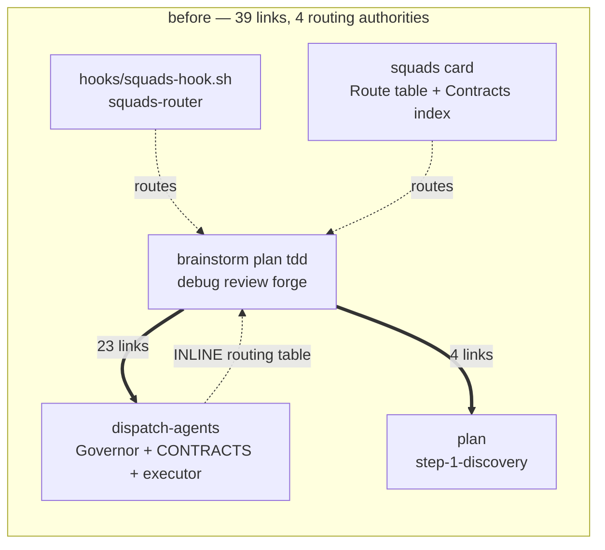
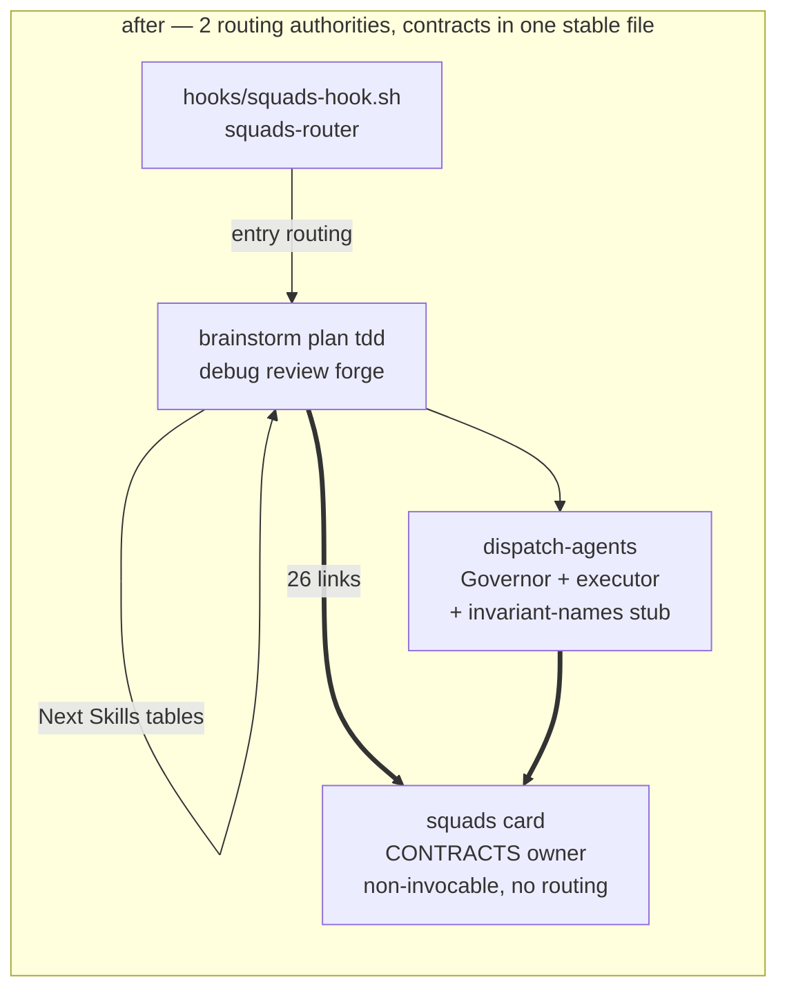

# skills restructure — Design Brief

### Approach

Delete the two duplicate routing tables and invert `skills/squads/SKILL.md` from a contract index into the contract owner, leaving `dispatch-agents` as Governor plus approved-plan executor.

### Why

- 27 of 39 cross-skill anchor links point at four contract anchors currently embedded in the two most-edited executable skills; moving them to a non-invocable card makes the link targets stop churning for behavioral reasons.
- Routing has four authorities today (`hooks/squads-hook.sh:62-66`, the card Route table, the `dispatch-agents` INLINE table, eight `## Next Skills` tables) plus a fifth partial copy in the Governor Threshold Table lifecycle row; deleting the two full copies and de-routing the Threshold row leaves two non-overlapping authorities.
- `skills/squads/SKILL.md` already claims to be the contract index and already cannot be invoked (`disable-model-invocation: true`, `user-invocable: false`) — owning contracts is the job it half-performs, so the fix uses the repo's existing reference-card pattern and adds no files.
- Rejected alternative C (merge `forge-workflow` into `dispatch-agents`, 8 files → 6) removes more duplication but deletes two user-facing skill names; rejected alternative A (routing dedupe only) leaves all 27 contract links pointing into an executable skill.

### Scope

L

### Constraints

- No build step, no Node runtime beyond the `prettier` devDependency (AGENTS.md) — the anchor check must be bash/grep inside `format:check`, never a Node script.
- No CI in this repo; any mechanical check is maintainer-run only. Accepted.
- Plugin ships markdown only; nothing generated ships.
- `skills/squads/SKILL.md` stays `disable-model-invocation: true` / `user-invocable: false` — contracts there are reached by link, never by invocation. This is the load-bearing assumption of the approach.
- Heading text of every moved contract must survive the move byte-identical, so the existing anchor slugs stay valid at the new path.
- `jq` on PATH; 5-min flat per-subagent budget; hooks deny-only. Unaffected, listed so the migration does not disturb them.

### Interface

Anchor migrations — old target → new target. Heading text unchanged in every row.

| Anchor                                                  | From                       | To                                                     |
| :------------------------------------------------------ | :------------------------- | :----------------------------------------------------- |
| `#invariants--apply-to-every-dispatch`                  | `dispatch-agents/SKILL.md` | `squads/SKILL.md`                                      |
| `#handoff-contract`                                     | `dispatch-agents/SKILL.md` | `squads/SKILL.md`                                      |
| `#model--fan-out-policy`                                | `dispatch-agents/SKILL.md` | `squads/SKILL.md`                                      |
| `#step-1-discovery` (untrusted-context convention only) | `plan/SKILL.md`            | `squads/SKILL.md` — new `## Untrusted content` heading |
| `#step-1-discovery` (`Origin:` header semantics)        | `plan/SKILL.md`            | unchanged — stays with `plan`                          |

Citation counts to repoint: `#handoff-contract` 9, `#invariants--apply-to-every-dispatch` 8, `#model--fan-out-policy` 6, `#step-1-discovery` 4 (3 repoint, 1 stays). Total 26 of 39 links rewritten.

Deletions:

| Deleted                                                            | Location                         | Replacement                                                                                    |
| :----------------------------------------------------------------- | :------------------------------- | :--------------------------------------------------------------------------------------------- |
| Route table                                                        | `squads/SKILL.md:16-25`          | injected `<squads-router>` block, already authoritative                                        |
| `## Resume` section                                                | `squads/SKILL.md:42-54`          | each skill's own resume step, which the table only pointed at                                  |
| INLINE branch routing table                                        | `dispatch-agents/SKILL.md:38-52` | fleet-shape list keyed by skill name; routing columns dropped                                  |
| Threshold Table lifecycle destinations                             | `dispatch-agents/SKILL.md:27`    | row becomes `Lifecycle match (per <squads-router>) → inline` — mode kept, destinations dropped |
| `<!-- do not rename: skills link #inline-branch-routing-table -->` | `dispatch-agents/SKILL.md:36`    | deleted with the table it guards                                                               |

Additions:

| Added                                                                                                                 | Location                   | Purpose                                                                     |
| :-------------------------------------------------------------------------------------------------------------------- | :------------------------- | :-------------------------------------------------------------------------- |
| Invariant-names stub (~9 lines, one line per invariant, no bodies)                                                    | `dispatch-agents/SKILL.md` | executing model sees the checklist inline; link followed only for full text |
| `<!-- do not rename: skills link #handoff-contract, #invariants--apply-to-every-dispatch, #model--fan-out-policy -->` | `squads/SKILL.md`          | guard migrates with the headings, text names the new home                   |
| `check:anchors` bash step appended to `format:check`                                                                  | `package.json:22`          | mechanical anchor resolution, see First Step                                |

Anchor check slug rule — three transforms, no slugger library:

```
lowercase → drop every char outside [a-z0-9 -] → spaces to hyphens
```

Verified against all 12 distinct anchors in the current tree. The two double-hyphen cases fall out correctly: `Invariants — apply to every dispatch` → `invariants--apply-to-every-dispatch`, `Model & fan-out policy` → `model--fan-out-policy`.

### Architecture





Component interactions after the change:

- `hooks/squads-hook.sh` owns entry routing; nothing else routes by trigger.
- Each skill's `## Next Skills` table owns its outgoing handoff edges; no central copy exists to drift against.
- `squads/SKILL.md` owns Invariants, Handoff Contract, Model & fan-out policy, and the untrusted-content convention. It routes nothing and is never invoked.
- `dispatch-agents` owns the Governor (mode selection only) and the approved-plan executor, and carries an inline stub naming the invariants it must honor.
- `plan` retains `Origin:` header semantics and the Canonical Task Block Schema.
- `forge-workflow` retains Pattern Canon, Recipe Catalog, Preflight. Untouched except for repointed contract links.

### Risks

- **HIGH — silent invariant loss on dispatch.** After the move, `dispatch-agents` no longer ships its invariants inline; a model that does not follow the link executes a fleet without them. _Mitigation:_ the invariant-names stub keeps the full checklist visible at the dispatch site; only the bodies live behind the link.
- **HIGH — anchor breakage during the 26-link rewrite, with nothing to catch it.** Markdown has no compiler; a typo'd anchor is a silently dead link. _Mitigation:_ land the `check:anchors` step and prove it green on the untouched tree BEFORE any link is rewritten, so a red result after the rewrite is attributable to the rewrite.
- **MED — incomplete routing dedupe.** Deleting only the two full tables leaves the Governor Threshold Table's lifecycle row as a third copy. _Mitigation:_ de-route that row in the same commit; it decides mode, not destination.
- **MED — over-broad `#step-1-discovery` repoint.** A blanket rewrite would move `dispatch-agents:103`, which cites `plan` for `Origin:` semantics rather than the convention. _Mitigation:_ repoint per citation against the 4-item list, not by sed.
- **MED — check is maintainer-only.** No CI exists and AGENTS.md forbids a build step, so a broken anchor still ships if `npm run format:check` is skipped. _Accepted residual risk_ — strictly better than today's zero checks; adding CI exceeds this restructure.
- **LOW — `/squads` remains inert.** The card grows in importance while staying `user-invocable: false`, so a reader who types `/squads` gets nothing. Not addressed; out of scope.
- **Explicitly not addressed:** guardrail triplication across `dispatch-agents` Invariants, `forge-workflow` Generation Contract, and the Script Audit Checklist (5 of 7 forge invariants restate dispatch invariants); `debug`'s hard dependency on `forge-workflow#preflight`. Both were surveyed and left to a later pass.

### First Step

Append an anchor-resolution check to `package.json` `format:check` and prove it green on the current, unmodified tree — this is the guard the whole migration leans on, so it lands before a single link moves:

```
format:check: bash -n hooks/*.sh && bash scripts/check-anchors.sh && prettier --check .
```

`scripts/check-anchors.sh` extracts every `../<skill>/SKILL.md#<anchor>` link under `skills/`, slugs each heading in the target file with the three-rule transform above, and exits non-zero on any link whose anchor has no matching heading.
