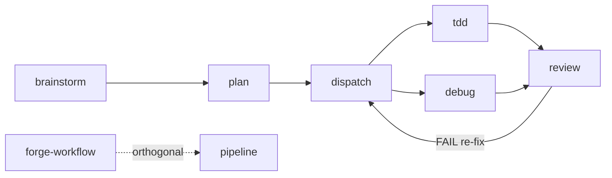

# squads

Index/map of the squads skill set. Not a workflow — invoke to see the topology, then route to the right skill. For routing a concrete task to a workflow, use [dispatch-agents](../dispatch-agents/SKILL.md) (the request router); this skill is the conventions/map index.

## Naming rule

| Class             | Pattern    | Skills                                  |
| :---------------- | :--------- | :-------------------------------------- |
| Pipeline          | plain noun | `brainstorm`, `plan`, `debug`, `review` |
| Fan-out execution | verb-noun  | `dispatch-agents`, `forge-workflow`     |
| Grandfathered     | acronym    | `tdd`                                   |

New pipeline skills take a plain noun; new fan-out execution skills take a verb-noun. Fan-out semantics live in each skill's `description:` frontmatter, not in the name.

## Routing DAG

`brainstorm → plan → dispatch-agents → {tdd | debug} → review → (FAIL re-fix → dispatch-agents)`. `forge-workflow` is orthogonal (saved `/command` workflows for recurring/large fan-out).

**Authoritative source:** each skill's own `## Next Skills` table is authoritative for its outgoing edges; this DAG is the overview. If the two disagree, the skill's table wins — update this DAG to match.

## Shared contracts

| Contract                                                | Owner (anchor)                                                                                                                  |
| :------------------------------------------------------ | :------------------------------------------------------------------------------------------------------------------------------ |
| Handoff Contract (subagent → main-thread return struct) | [dispatch-agents/SKILL.md#handoff-contract](../dispatch-agents/SKILL.md#handoff-contract)                                       |
| Invariants (apply to every dispatch)                    | [dispatch-agents/SKILL.md#invariants--apply-to-every-dispatch](../dispatch-agents/SKILL.md#invariants--apply-to-every-dispatch) |
| `<untrusted_context>` wrap convention                   | [plan/SKILL.md](../plan/SKILL.md) Step 1 Discovery                                                                              |
| Fan-out scaling (many small agents, flat 5-min budget)  | [dispatch-agents/SKILL.md](../dispatch-agents/SKILL.md) Model & fan-out policy                                                  |

## Next Skills

| Skill                                          | Use Case                                                                |
| :--------------------------------------------- | :---------------------------------------------------------------------- |
| [dispatch-agents](../dispatch-agents/SKILL.md) | Route a concrete task/request to a workflow (the request router)        |
| [brainstorm](../brainstorm/SKILL.md)           | Vague requirements, open solution space, ≥2 architectural approaches    |
| [plan](../plan/SKILL.md)                       | Draft a plan/spec, or validate an existing plan                         |
| [tdd](../tdd/SKILL.md)                         | Single new logic behavior, or a TDD red flag                            |
| [debug](../debug/SKILL.md)                     | Test, `Validate:`, or runtime fail unexpectedly — before any fix        |
| [review](../review/SKILL.md)                   | Fresh-eye review of a verified diff, or resolve review feedback         |
| [forge-workflow](../forge-workflow/SKILL.md)   | Bulk independent items, whole-repo audit, or saved `/command` workflows |
